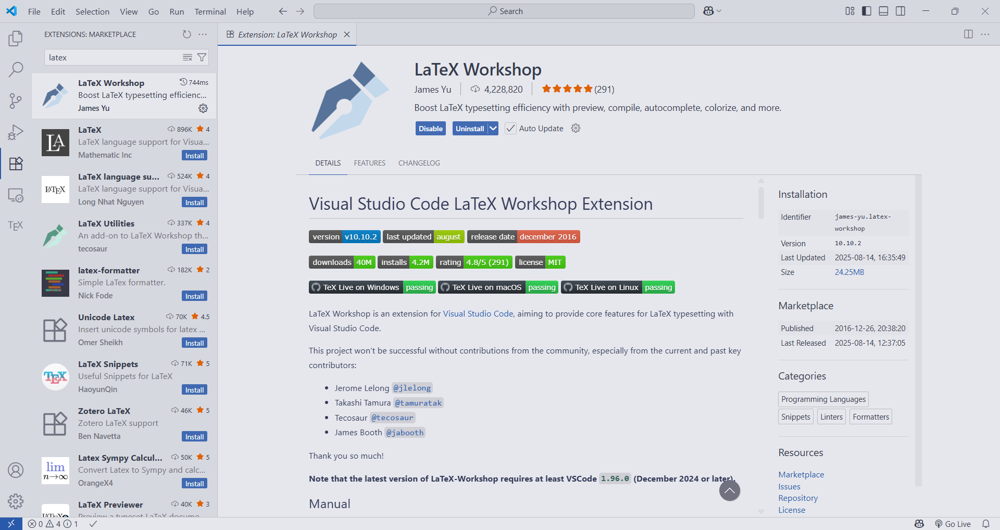
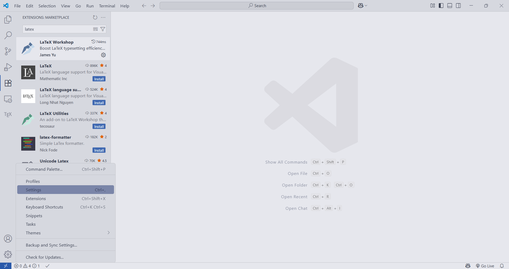
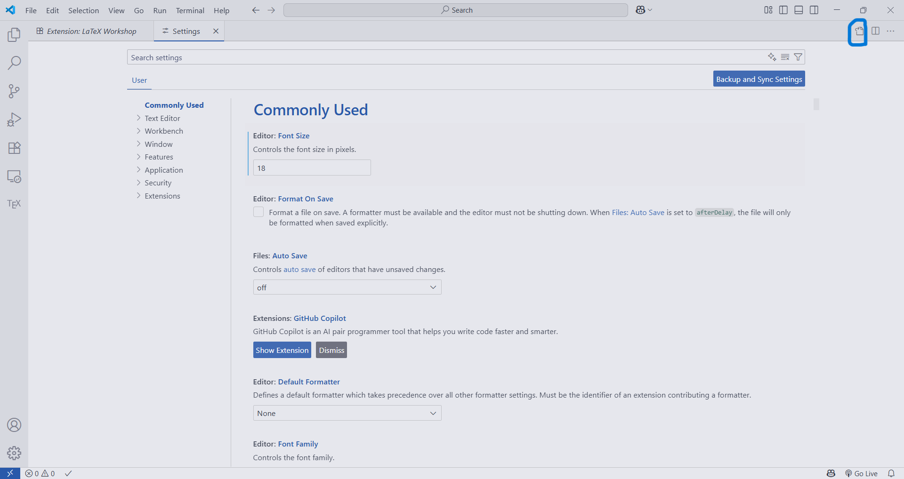
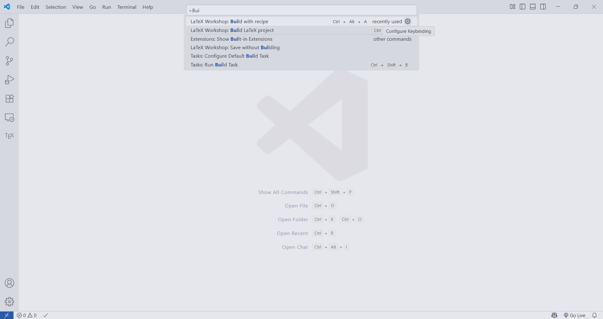
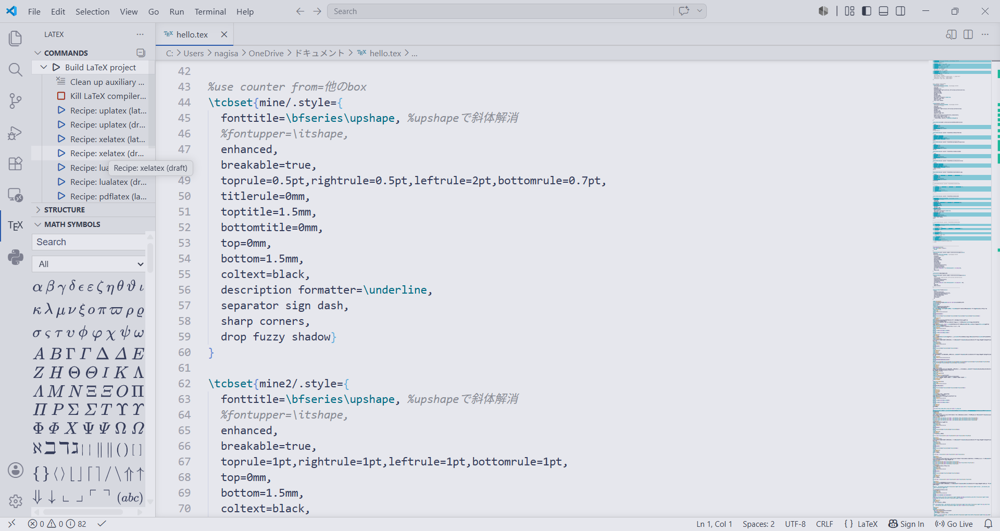

# LaTeX_on_VSCode
This is a json file for building LaTeX environment on VSCode with LaTeX Workshop.

# How to use

1. Make sure TeXLive and VSCode are installed on your PC. You can check the installation of TeXLive by running command like this.
    ```
    latex --version
    ```

1. Add extension "LaTeX Workshop " by James-Yu to your VSCode.

    

1. Open settings.json in your VSCode and add cord in LaTeX_settings.
json in this repository.

    

    

    ```json
    //ソースコードの折り返し有効化
    "[ latex]": {
    "editor.wordWrap": "on"
    },
    //生成ファイルの削除のタイミング
    "latex-workshop.latex.autoClean.run": "onSucceeded",
    //隣にビューワーのタブを表示
    "latex-workshop.view.pdf.viewer": "tab",
    // 使用パッケージのコマンドや環境の補完を有効にする
    "latex-workshop.intellisense.package.enabled": true,
    //削除する補助ファイルたち
    "latex-workshop.latex.clean.fileTypes": [
        "%DOCFILE%.aux",
        "%DOCFILE%.bbl",
        "%DOCFILE%.blg",
        "%DOCFILE%.idx",
        "%DOCFILE%.ind",
        "%DOCFILE%.lof",
        "%DOCFILE%.lot",
        "%DOCFILE%.out",
        "%DOCFILE%.toc",
        "%DOCFILE%.acn",
        "%DOCFILE%.acr",
        "%DOCFILE%.alg",
        "%DOCFILE%.glg",
        "%DOCFILE%.glo",
        "%DOCFILE%.gls",
        "%DOCFILE%.fls",
        "%DOCFILE%.log",
        "%DOCFILE%.fdb_latexmk",
        "%DOCFILE%.snm",
        "%DOCFILE%.synctex(busy)",
        "%DOCFILE%.synctex.gz",
        "%DOCFILE%.nav",
        "%DOCFILE%.vrb",
        "%DOCFILE%.dvi"
    ],

    "latex-workshop.latex.tools": [
    {
        "name": "latexmk-uplatex",
        "command": "latexmk",
        "args": [
            "-synctex=1", //synctex を有効 (pdf からのジャンプ等)
            "-halt-on-error", //
            "-file-line-error",// 最初のエラーで処理を停止
            "-interaction=nonstopmode",//エラーで停止しない for 柔軟性
            "-latex=uplatex",//コンパイルエンジン
            "-e",
            "$dvipdf='dvipdfmx %O -o %D %S'",
            "-pdfdvi",
            "%DOC%"
        ]
    },
    {
        "name": "ptex2pdf-uplatex-draft",
        "command": "ptex2pdf",
        "args": [
            "-u",//uplatex を使用
            "-l",
            "-ot", //以下はオプション
            "-kanji=utf8",
            "-halt-on-error",
            "-synctex=1",
            "-interaction=nonstopmode",
            "-file-line-error",
            "%DOC%"
        ]
    },
    {
        "name": "latexmk-xelatex",
        "command": "latexmk",
        "args": [
            "-synctex=1",
            "-halt-on-error",
            "-file-line-error",
            "-interaction=nonstopmode",
            "-xelatex",
            "%DOC%"
        ]  
    },

    {
        "name": "xelatex-draft",
        "command": "xelatex",
        "args": [
            "-synctex=1",
            "-halt-on-error",
            "-file-line-error",
            "-interaction=nonstopmode",
            "%DOC%"
        ]
    },

    {
        "name": "latexmk-lualatex",
        "command": "latexmk",
        "args": [
            "-synctex=1",
            "-halt-on-error",
            "-file-line-error",
            "-interaction=nonstopmode",
            "-lualatex",
            "%DOC%"
        ]
    },

    {
        "name": "lualatex-draft",
        "command": "lualatex",
        "args": [
            "-synctex=1",
            "-halt-on-error",
            "-file-line-error",
            "-interaction=nonstopmode",
            "%DOC%"
        ]
    },


    {
        "name": "latexmk-pdflatex",
        "command": "latexmk",
        "args": [
            "-synctex=1",
            "-halt-on-error",
            "-file-line-error",
            "-interaction=nonstopmode",
            "-pdf",
            "%DOC%"
        ]
    },
        
    {
        "name": "pdflatex-draft",
        "command": "pdflatex",
        "args": [
            "-synctex=1",
            "-halt-on-error",
            "-file-line-error",
            "-interaction=nonstopmode",
            "%DOC%"
        ]
    },
    ],

    "latex-workshop.latex.recipes": [
    {
        "name": "uplatex (latexmk)",
        "tools": ["latexmk-uplatex"]
    },
    {
        "name": "uplatex (draft)",
        "tools": ["ptex2pdf-uplatex-draft"]
    },
    {
        "name": "xelatex (latexmk)",
        "tools": ["latexmk-xelatex"]
    },
    {
        "name": "xelatex (draft)",
        "tools": ["xelatex-draft"]
    },
    {
        "name": "lualatex (latexmk)",
        "tools": ["latexmk-lualatex"]
    },
    {
        "name": "lualatex (draft)",
        "tools": ["lualatex-draft"]
    },
    {
        "name": "pdflatex (latexmk)",
        "tools": ["latexmk-pdflatex"]
    },
    {
        "name": "pdflatex (draft)",
        "tools": ["pdflatex-draft"]
    }
    ],
    //自動ビルドは無効化
    "latex-workshop.latex.autoBuild.run": "never",
    ```


1. You can choose a compile engine by typing 

    ```
    > build with recipe
    ```` 
    on searching window or menu on the left side in your VSCode. 

    
    
    


1. You can also set your original shortcut.


